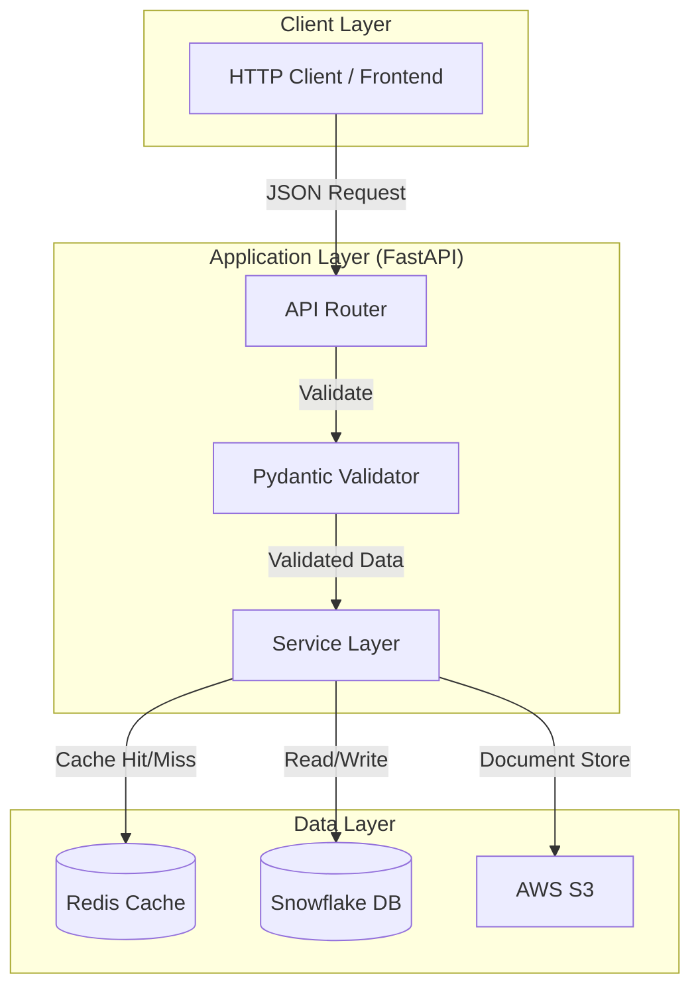

# PE Org-AI-R Platform (Case Study 1)

**Platform Foundation: AI-Readiness Assessment System**

---

## 🔗 Project Links

- **Codelabs Documentation**: https://codelabs-preview.appspot.com/?file_id=1gWQbNSjFmc7EzAxUR_S1er1Ca3GuVudQpuJXG1aqY30
- **Video Presentation**: _[Insert Video Link Here]_
- **Live Application**: _[Insert Streamlit/FastAPI URL Here]_

---

## 📋 Project Overview

The **PE Org-AI-R (Organizational AI-Readiness)** platform enables private equity firms to systematically assess the AI-readiness of portfolio companies.

### Case Study 1: Platform Foundation

Establishes the **"Zero to API"** core infrastructure with production-grade validation, persistence, caching, and deployment.

### Scope & Features

- **RESTful API**: 12+ endpoints for Companies, Assessments, and Dimension Scores
- **Data Validation**: Strict Pydantic models enforcing business rules (scores 0–100)
- **Persistence Layer**: Normalized Snowflake schema
- **Caching Strategy**: Redis layer for read optimization
- **Infrastructure**: Fully containerized using Docker

**Tech Stack**: Python 3.11+, FastAPI, Snowflake, Redis, Docker, Pydantic v2

---

## 🏗️ Architecture



> If the Mermaid diagram does not render, use a Mermaid-compatible viewer.

---

## 📂 Directory Structure

```
pe-org-air-platform/
├── app/
│   ├── database/
│   │   └── schema.sql
│   ├── models/
│   │   ├── company.py
│   │   ├── assessment.py
│   │   ├── dimension.py
│   │   └── common.py
│   ├── routers/
│   │   ├── companies.py
│   │   ├── assessments.py
│   │   ├── health.py
│   ├── services/
│   │   ├── snowflake.py
│   │   └── redis_cache.py
│   ├── main.py
│   ├── config.py
│   └── logging.py
├── docker/
│   ├── Dockerfile
│   └── compose.yaml
├── scripts/
│   ├── init_db.py
│   └── test_connection.py
├── tests/
│   ├── test_api.py
│   └── test_models.py
├── pyproject.toml
└── README.md
```

---

## 🚀 Step-by-Step Guide

### 1. Prerequisites

- Docker Desktop running
- Snowflake account with DB, schema, warehouse
- Python 3.10+ (optional, for local run)

---

### 2. Configuration

Create a `.env` file in `docker/` (or root):

```env
SNOWFLAKE_ACCOUNT=your_account_identifier
SNOWFLAKE_USER=your_username
SNOWFLAKE_PASSWORD=your_password
SNOWFLAKE_DATABASE=PE_ORG_AIR_DB
SNOWFLAKE_SCHEMA=PUBLIC
SNOWFLAKE_WAREHOUSE=COMPUTE_WH
REDIS_HOST=redis
REDIS_PORT=6379
```

---

### 3. Initialization & Execution

```bash
cd docker
docker-compose up --build
```

---

### 4. Verification

- Health Check: http://localhost:8000/health
- API Docs: http://localhost:8000/docs

Run tests:

```bash
docker-compose exec api pytest
```

---

## 👥 Team Member Contributions

| Team Member        | Contributions                                                       |
| ------------------ | ------------------------------------------------------------------- |
| **Deep Prajapati** | FastAPI shell, Pydantic validation models, DB schema                |
| **Tapan Patel**    | System architecture, Snowflake persistence layer                    |
| **Seamus McAvoy**  | Redis caching, Docker infrastructure, testing suite, S3 integration |

---

## 🤖 AI Usage Disclosure

- **Claude & Gemini**: Debugging validation logic, generating Pydantic models, SQL optimization, requirement verification
- **GitHub Copilot**: Inline code completion and documentation
